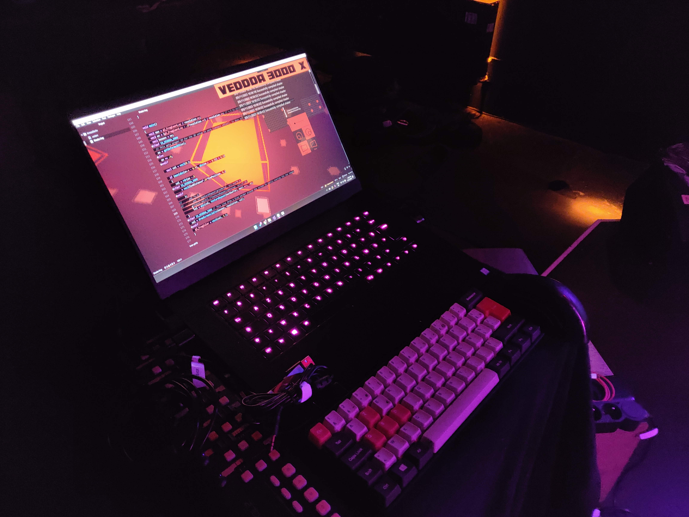
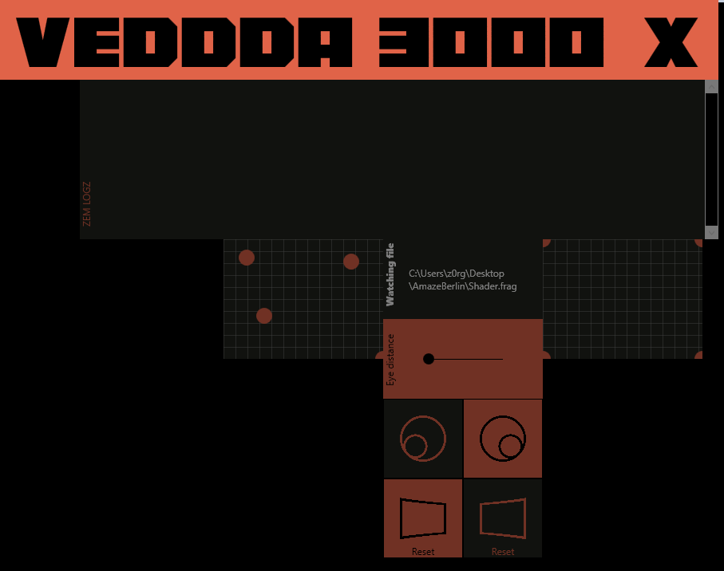
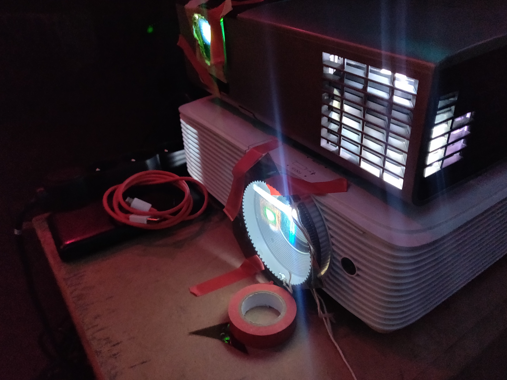

# veDDDa 3000
A livecoding environnement for 3D (glasses) shader coding based on veda.

## What can I do with it ?
If you're a shader developer, you can use it to livecode shaders the way you are used to and veDDDa 3000 does the job to display it properly in 3D.

### Features
* Interfaced with [veda](https://veda.gl/vedajs/)
* Hot reload
* Eyes calibration interface
* FFT
* Textures support through .vedarc
* backbuffer
* Console log

## A bit of story
veDDDa 3000 started as an envy to try to make 3D visuals like in cinemas but with livecoded shaders. 
After a bit of research and a few tests I gathered everything I needed to create my own 3D setup (screen, videorprojectors...)
Now I'm using it to do live performances :)

### How does it work ?
For displaying 3D images that the human eye can perceive as 3D, we need a way to make each receive a different image. Those images have to be separated by a distance simulating the distance between the two eyes.
Generating two different images is the easy part, the harder one is making each eye perceive a unique image. To do so there are two main ways of doing 3D using video projectors either Active or Passive.
Both ways are using glasses.

### Active 3D (synchronised)
Active 3D uses some kind of synchronisation to the beamer to alternante between the left and right eye images and the glasses are sync to this by different ways (DLP link, IR, bluetooth...) and make the glass "flicker" in sync with the beamer allowing each eye to see the proper image.

#### Pros
* Good image quality
* Keeps brightness
* Keeps colors
* 1 Video projector
* 
#### Cons
* Expensive (50$ glasses)
* Specific to the beamer
* Need to charge the glasses
* Can be interfered with

### Passive 3D
Passive 3D does not use active synchronisation, only using passive filters. It relies on light [polarization](https://en.wikipedia.org/wiki/Polarization_(physics)) to work. Basically light can have a sort of "angle" property allowing to have a "perpendicular" filter blocking light or "parallel" filter allowing light to pass through.
The setup consists in two beamers each one having an orthogonal (to each other and aligned with glasses) polarization filter in front of it.
It also requires a specific screen that keeps light polarization. This is actually the harder part of the setup as the proper screens are extremly expensive as they are usually sold to cinemas.

Polarization can be done either linear or radial, the only difference being that tilting your head works with radial polarization but "breaks" the immersion with linear polarization.

#### Pros
* Cheap glasses (less than 1$)
* Good image quality
* Keeps colors
#### Cons
* Expensive screen
* Low brightness
* Low viewing angle
* 2 beamers
* A bit harder to setup

### Anaglyph
The main way people know to make 3D is the old Cyan-Red glasses which are called anaglyph.
#### Pros
* Cheap glasses
* 1 beamer
#### Cons
* Strongly affects colors
* Subject to "ghosting"

### My setup
I personnaly chose Passive Linear 3D to make live performances with it, cheap glasses and good color quality were my criteria allowing to have an immersive result and being able to make the most people to watch it live.
Finding the resources at a good price was a challenge in itself so here are the product I found

* [Screen](https://www.amazon.fr/dp/B00BRGRQBC?psc=1&ref=ppx_yo2ov_dt_b_product_details)
* [Plastic glasses](https://www.amazon.fr/dp/B01D1GPSIS?psc=1&ref=ppx_yo2ov_dt_b_product_details)
* [Cheaper glasses](https://www.amazon.fr/dp/B0071L36LQ?psc=1&ref=ppx_yo2ov_dt_b_product_details)
* [Polarization filters](https://www.amazon.fr/dp/B01A5PZ01I?psc=1&ref=ppx_yo2ov_dt_b_product_details)

## Roadmap
* Add midi support
* Make it compatible with other 3D softwares (IO, main function...)
* Handle GLSLify
* Handle includes
* Autocalibration
* Finer calibration
* Setup / Live mode
* Avoid compiling shader 2 times
* Show code
* Add anaglyph support
* Add top-down / left-right and frame alternating support
* Display hardware stats (GPU, CPU...)
* Prefix boilerplate functions to avoid name collisions
* BUG Texture FFT is mixed with other textures (wrong texture unit ?)
* Handle multipass ?